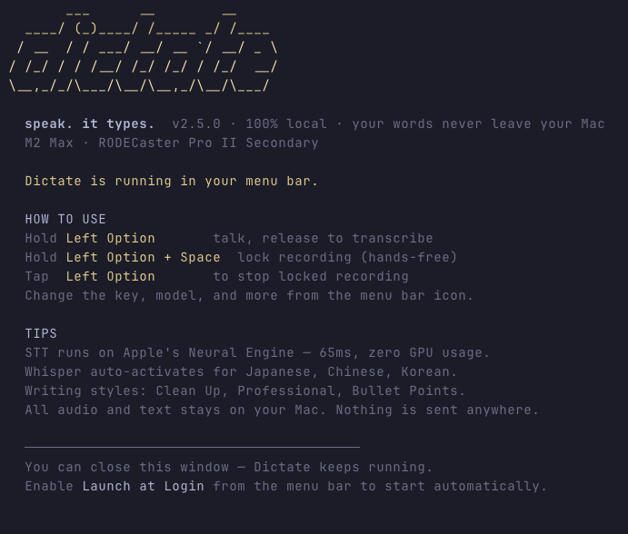

<p align="center">
  
</p>

<h3 align="center">Push-to-talk voice dictation that runs entirely on your Mac.<br>No cloud. No API keys. No subscriptions.</h3>

<p align="center">
  <a href="https://pypi.org/project/dictate-mlx/"></a>
  <a href="https://github.com/0xbrando/dictate/blob/main/LICENSE"></a>
  
  
  
  
</p>

<p align="center">
  <b>Hold a key → Speak → Release → Clean text appears wherever your cursor is.</b>
</p>

<!-- TODO: Replace with actual demo GIF once recorded -->
<!-- <p align="center"></p> -->

---

## Why Dictate?

- **65ms voice-to-text** on Apple's Neural Engine — faster than a keystroke
- **Zero GPU RAM** for STT — the Neural Engine has its own dedicated memory
- **100% local** — audio and text never leave your Mac
- **Free and open source** — no subscriptions, no API keys, no accounts
- **LLM text cleanup** — local model fixes grammar and punctuation automatically
- **52+ languages** — real-time translation between any supported pair

Your M-series Mac has a 16-core Neural Engine doing nothing. Dictate puts it to work.

## Install

```bash
pip install dictate-mlx
dictate
```

That's it. Dictate launches in the background and appears in your menu bar. Close the terminal — it keeps running.

For Qwen3-ASR support (52-language STT engine):

```bash
pip install dictate-mlx[qwen3-asr]
```


macOS will prompt for **Accessibility** and **Microphone** permissions on first run. Models download automatically (~1-3GB depending on preset, cached in `~/.cache/huggingface/`).

<details>
<summary><b>Install from source</b></summary>

```bash
git clone https://github.com/0xbrando/dictate.git
cd dictate
python3 -m venv .venv
source .venv/bin/activate
pip install -e .
dictate
```
</details>

### Requirements

- macOS with Apple Silicon (any M-series chip)
- Python 3.11+
- ~3GB RAM with ANE (STT runs on Neural Engine, only LLM needs GPU memory)

## Features

### Push-to-Talk

Hold a key, speak, release. Text appears wherever your cursor is.

| Action | Key |
|--------|-----|
| Record | Hold Left Control |
| Lock recording (hands-free) | Press Space while holding PTT |
| Stop locked recording | Press PTT again |

The PTT key is configurable: Left Control, Right Control, Right Command, or either Option key.

### LLM Text Cleanup

**The thing that sets Dictate apart.** Most dictation tools give you raw transcription. Dictate pipes through a local LLM that fixes grammar, adds punctuation, and formats properly.

Short phrases (≤15 words) skip cleanup for instant speed. Longer dictation gets the full treatment.

### Four STT Engines

All included. Switch anytime from the menu bar.

| Engine | Speed | Languages | Notes |
|--------|-------|-----------|-------|
| **ANE (Neural Engine)** | **~65ms** | 25 | Default — runs on Apple Neural Engine, frees GPU for LLM |
| **Qwen3-ASR 0.6B** | ~50ms | 52 | Fastest multilingual — includes CJK, Arabic, Hindi |
| **Parakeet TDT 0.6B** | ~50ms | 25 | European languages, GPU via MLX |
| **Whisper Large V3 Turbo** | ~300ms | 99+ | Maximum language coverage |

ANE is the default. It runs speech recognition on Apple's Neural Engine — a dedicated chip that sits idle during most tasks. This frees the GPU entirely for LLM text cleanup, so STT and LLM run concurrently with zero contention. The result: **65-106ms transcription** on real speech.

**Qwen3-ASR** is the new recommended GPU engine — 52 languages including Japanese, Chinese, and Korean at Parakeet-level speed. Requires `pip install mlx-audio`.

Dictate auto-switches engines based on language: ANE/Parakeet for European languages, Qwen3-ASR for CJK and others, Whisper as the universal fallback.

### Writing Styles

| Style | What it does |
|-------|-------------|
| **Clean Up** | Fixes punctuation and capitalization — keeps your words |
| **Professional** | Polished tone and grammar |
| **Bullet Points** | Rewrites as concise bullet points |

Toggle LLM cleanup off from the menu bar for raw transcription output.

### Real-Time Translation

Speak in one language, get output in another. 12 languages supported: English, Spanish, French, German, Italian, Portuguese, Japanese, Korean, Chinese, Russian, Arabic, Hindi.

### Quality Presets

| Preset | Speed | Size | Best for |
|--------|-------|------|----------|
| **Qwen2.5 1.5B** | ~250ms | 950MB | Fast and lightweight |
| **Qwen3.5 2B** | ~280ms | 1.3GB | Best balance (default) — newer, smarter |
| **Qwen2.5 3B** | ~400ms | 1.8GB | Max accuracy |
| **API Server** | varies | 0 | Use your own LLM server (LM Studio, Ollama, etc.) |

Short phrases (15 words or less) skip LLM cleanup entirely for instant output. The app picks the best default model for your chip.

### End-to-End Pipeline

Full latency from voice → text on screen:

| Mode | GPU RAM | Latency |
|------|---------|---------|
| LLM off (raw transcription) | **0** | **~65ms** |
| LLM on (Qwen3.5 2B) | ~1.3GB | ~345ms |
| LLM on (Qwen2.5 3B) | ~1.8GB | ~465ms |

With ANE, speech recognition runs on a dedicated chip with its own memory — zero GPU usage. Turn off LLM cleanup and the entire app uses no GPU RAM at all.

## Menu Bar

Everything accessible from the waveform icon:

- **Writing Style** — Clean Up, Professional, Bullet Points
- **Quality** — Qwen2.5 1.5B, Qwen3.5 2B, Qwen2.5 3B, or API server
- **Input Device** — select microphone
- **Recent** — last 10 transcriptions, click to re-paste
- **STT Engine** — ANE (default), Qwen3-ASR, Parakeet, or Whisper
- **PTT Key** — choose your push-to-talk modifier
- **Languages** — input and output language
- **Sounds** — 6 notification tones or silent
- **Personal Dictionary** — names, brands, technical terms always spelled correctly
- **Launch at Login** — auto-start on boot

## ANE Engine Setup

The ANE (Apple Neural Engine) engine is the default and recommended STT engine. It requires a small Swift binary that Dictate calls behind the scenes. If the binary isn't installed, Dictate falls back to Parakeet (GPU-based STT).

```bash
# Build from source (requires Xcode command line tools)
cd swift-stt
swift build -c release

# The binary lands at swift-stt/.build/release/dictate-stt
# Either add it to your PATH or leave it — Dictate finds it automatically
```

**First run:** CoreML models download automatically (~2.7GB) and compile for your chip. This takes 1-2 minutes the first time. After that, models are cached and transcription starts instantly.

**Requirements:** macOS 14+ (Sonoma or later), Apple Silicon.

**What it does:** The `dictate-stt` binary uses [FluidAudio](https://github.com/FluidInference/FluidAudio) to run Parakeet speech recognition on the Neural Engine via CoreML. All processing is local — no network calls after the initial model download.

<details>
<summary><b>How it works</b></summary>

When you select ANE in the menu bar, Dictate calls the `dictate-stt` binary as a subprocess:

1. Dictate records audio and saves it as a temporary WAV file
2. Calls `dictate-stt transcribe /tmp/audio.wav`
3. The Swift binary runs the audio through CoreML on the Neural Engine
4. Returns JSON to stdout: `{"text": "Hello world", "duration_ms": 68}`
5. Dictate parses the result and pipes it through LLM cleanup as usual

The binary is a standalone executable with no Python dependency. You can also use it directly:

```bash
dictate-stt check                    # Verify ANE is available
dictate-stt transcribe recording.wav # Transcribe a WAV file
```
</details>

## API Server

If you run a local LLM server, Dictate can use it instead of loading its own model — zero additional RAM:

```bash
DICTATE_LLM_BACKEND=api DICTATE_LLM_API_URL=http://localhost:8005/v1/chat/completions dictate
```

Works with any OpenAI-compatible server: [vllm-mlx](https://github.com/vllm-project/vllm-mlx), [LM Studio](https://lmstudio.ai), [Ollama](https://ollama.com).

The **Smart** preset auto-routes by length: short phrases → fast local model (~120ms), longer dictation → your API server.

## Environment Variables

<details>
<summary><b>All environment variables</b></summary>

| Variable | Description | Default |
|----------|-------------|---------|
| `DICTATE_AUDIO_DEVICE` | Microphone device index | System default |
| `DICTATE_OUTPUT_MODE` | `type` or `clipboard` | `type` |
| `DICTATE_STT_ENGINE` | `ane`, `qwen3-asr`, `parakeet`, or `whisper` | `ane` |
| `DICTATE_INPUT_LANGUAGE` | `auto`, `en`, `ja`, `ko`, etc. | `auto` |
| `DICTATE_OUTPUT_LANGUAGE` | Translation target (`auto` = same) | `auto` |
| `DICTATE_LLM_CLEANUP` | Enable LLM text cleanup | `true` |
| `DICTATE_LLM_MODEL` | `qwen2.5-1.5b`, `qwen3.5-2b`, `qwen-3b` | `qwen3.5-2b` |
| `DICTATE_LLM_BACKEND` | `local` or `api` | `local` |
| `DICTATE_LLM_API_URL` | OpenAI-compatible endpoint | `http://localhost:8005/v1/chat/completions` |
| `DICTATE_ALLOW_REMOTE_API` | Allow non-localhost API URLs | unset |

</details>

## Agent Integration

Dictate works well as a voice input layer for AI assistants and agent frameworks. If you're building with tools like Claude Code, OpenClaw, or similar — Dictate gives your setup a local, private voice interface with zero cloud dependency.

## CLI Commands

```bash
dictate              # Launch in menu bar (backgrounds automatically)
dictate config       # View all preferences
dictate config set writing_style professional
dictate config set quality fast
dictate config set ptt_key cmd_r
dictate config set stt whisper
dictate config reset # Reset to defaults
dictate stats        # Show usage statistics
dictate status       # System info and model status
dictate doctor       # Run diagnostic checks (troubleshooting)
dictate devices      # List audio input devices
dictate update       # Update to latest version
dictate -f           # Run in foreground (debug)
dictate -V           # Show version
```

### Config Keys

| Key | Values |
|-----|--------|
| `writing_style` | clean, professional, bullets |
| `quality` | api, fast, balanced, quality |
| `stt` | ane, qwen3-asr, parakeet, whisper |
| `input_language` | auto, en, ja, de, fr, es, ... |
| `output_language` | auto, en, ja, de, fr, es, ... |
| `ptt_key` | ctrl_l, ctrl_r, cmd_r, alt_l, alt_r |
| `llm_cleanup` | on, off |
| `sound` | soft_pop, chime, warm, click, marimba, simple |
| `llm_endpoint` | host:port (for API backend) |

## Shell Completions

Tab completions for bash and zsh:

```bash
# Bash — add to ~/.bashrc
source /path/to/dictate/completions/dictate.bash

# Zsh — copy to fpath dir, then reload
cp completions/dictate.zsh ~/.zsh/completions/_dictate
autoload -Uz compinit && compinit
```

Completes commands, config keys, and all valid values.

## Debugging

```bash
# Run in foreground with logs
dictate --foreground

# Check background logs
tail -f ~/Library/Logs/Dictate/dictate.log
```

## Security

- All processing is local. Audio and text never leave your machine.
- Temporary audio files stored in a private directory with owner-only permissions — not world-readable /tmp.
- The ANE engine's `dictate-stt` binary is open source Swift code you build yourself from `swift-stt/`. CoreML models download from [Hugging Face](https://huggingface.co/FluidInference) on first run, then everything is cached locally.
- Models restricted to the `mlx-community/` HuggingFace namespace only.
- LLM endpoints restricted to localhost by default (`DICTATE_ALLOW_REMOTE_API=1` to override).
- Preferences and stats stored with `0o600` permissions (owner-only read/write).
- Log rotation (5MB, 3 backups) prevents disk exhaustion.
- HuggingFace telemetry disabled at startup (`DO_NOT_TRACK=1`).
- No API keys, tokens, or accounts required. No unsafe code patterns.

## Contributing

Issues and PRs welcome. Run the test suite before submitting:

```bash
python -m pytest tests/ -q
```

See [CONTRIBUTING.md](CONTRIBUTING.md) for guidelines.

## License

MIT — See [LICENSES.md](LICENSES.md) for dependency licenses.
