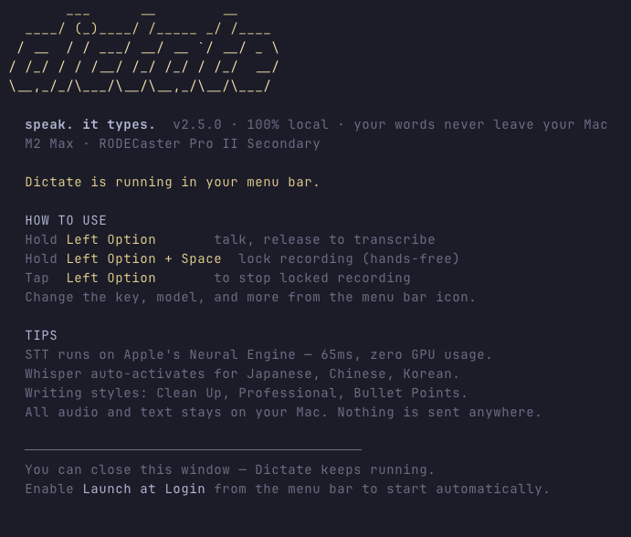

<p align="center">
  
</p>

<h3 align="center">Push-to-talk voice dictation that runs entirely on your Mac.<br>No cloud. No API keys. No subscriptions.</h3>

<p align="center">
  <a href="https://pypi.org/project/dictate-mlx/"></a>
  <a href="https://github.com/0xbrando/dictate/blob/main/LICENSE"></a>
  
  
  
  
</p>

<p align="center">
  <b>Hold a key → Speak → Release → Clean text appears wherever your cursor is.</b>
</p>

---

## Why Dictate?

- **Local speech recognition** accelerated by Apple Silicon
- **ANE acceleration** for STT — reduces GPU contention; model memory still comes from unified memory
- **Local inference by default** — optional remote text cleanup requires explicit opt-in
- **Free and open source** — no subscriptions, no API keys, no accounts
- **LLM text cleanup** — local model fixes grammar and punctuation automatically
- **Multiple languages** — engine coverage varies; optional LLM translation

Dictate can use your Mac’s Neural Engine for speech recognition.

## Install

```bash
pip install dictate-mlx
dictate
```

That's it. Dictate launches in the background and appears in your menu bar. Close the terminal — it keeps running.

For Qwen3-ASR support (30 languages plus 22 Chinese dialects):

```bash
pip install dictate-mlx[qwen3-asr]
```

This is still local-only. No API key is required; the extra installs the MLX Qwen3-ASR runtime.

Homebrew source install is available for users who prefer Brew. It builds the
Swift ANE helper and installs the Python app into a Homebrew-managed virtualenv:

```bash
brew tap 0xbrando/dictate
brew install dictate
```

The cask/DMG path is still planned; `pip install dictate-mlx` remains the
simplest install path.


macOS will prompt for **Accessibility** and **Microphone** permissions on first run. Dictate downloads only the selected default models, then caches them in `~/.cache/huggingface/`. Other cleanup models are one-click downloads from the **Quality** menu.

<details>
<summary><b>Install from source</b></summary>

```bash
git clone https://github.com/0xbrando/dictate.git
cd dictate
python3 -m venv .venv
source .venv/bin/activate
pip install -e .
dictate
```
</details>

### Requirements

- macOS with Apple Silicon (any M-series chip)
- Python 3.11+
- Several GB of unified memory and disk space for the selected models

## Features

### Push-to-Talk

Hold a key, speak, release. Text appears wherever your cursor is.

| Action | Key |
|--------|-----|
| Record | Hold Left Control |
| Lock recording (hands-free) | Press Space while holding PTT |
| Stop locked recording | Press PTT again |

The PTT key is configurable: Left Control, Right Control, Right Command, or either Option key.

### LLM Text Cleanup

**The thing that sets Dictate apart.** Most dictation tools give you raw transcription. Dictate pipes through a local LLM that fixes grammar, adds punctuation, and formats properly.

Clean, already formatted phrases of up to 8 words can skip cleanup. Translation and other writing styles still use the LLM.

### Local STT Engine Stack

Dictate is designed around local speech recognition. Switch anytime from the menu bar.

| Engine | Speed | Languages | Notes |
|--------|-------|-----------|-------|
| **ANE / FluidAudio** | varies | 25 | Default — Parakeet TDT v3 through Core ML on Apple Neural Engine |
| **Qwen3-ASR 0.6B** | varies | 30 + 22 dialects | Best broad multilingual local path — includes CJK, Arabic, Hindi |
| **Parakeet TDT v3 0.6B** | varies | 25 | Fast European-language GPU/MLX fallback |
| **Whisper Large V3 Turbo** | varies | 99+ | Compatibility fallback for maximum language coverage |

ANE is the default. It runs Parakeet through [FluidAudio](https://github.com/FluidInference/FluidAudio) and Core ML. This reduces GPU contention, but Apple Silicon shares unified memory across processors. Dictate currently transcribes and then cleans text sequentially. Latency depends on clip length, model, hardware, and whether models are warm.

**Qwen3-ASR** is the recommended local multilingual engine — 30 languages and 22 Chinese dialects, including Japanese, Chinese, and Korean. Requires `pip install dictate-mlx[qwen3-asr]`.

Dictate auto-switches engines based on language: ANE/Parakeet for European languages, Qwen3-ASR for CJK and others, Whisper as the universal fallback.

### Writing Styles

| Style | What it does |
|-------|-------------|
| **Clean Up** | Fixes punctuation and capitalization — keeps your words |
| **Professional** | Polished tone and grammar |
| **Bullet Points** | Rewrites as concise bullet points |
| **Email** | Formats as a concise, polished email |
| **Slack/Chat** | Clear conversational message |
| **Technical** | Precise technical wording |
| **Tweet** | Short social post |
| **Raw** | Exact transcription with no LLM rewrite |

Toggle LLM cleanup off from the menu bar for raw transcription output.

### Real-Time Translation

Speak in one language, get output in another. 12 languages supported: English, Spanish, French, German, Italian, Portuguese, Japanese, Korean, Chinese, Russian, Arabic, Hindi.

### Quality Presets

Dictate does not install every LLM up front. First run downloads the recommended default for your Mac; selecting another local Quality preset downloads that model once and reuses it forever. If you already run Ollama, LM Studio, vLLM, or another OpenAI-compatible localhost server, choose **Local API Server** to avoid loading a Dictate-managed cleanup model.

| Preset | Speed | Size | Best for |
|--------|-------|------|----------|
| **Fast — Qwen2.5 1.5B** | varies | 950MB | Lowest RAM, quick cleanup |
| **Balanced — Qwen3.5 2B** | varies | 1.3GB | Default for most Macs; newer small-model option |
| **Quality — Qwen2.5 3B** | varies | 1.8GB | Larger alternative; compare on your dictation |
| **Local API Server** | varies | 0 | Use your own localhost LLM server (LM Studio, Ollama, etc.) |

Clean phrases of up to 8 words can skip cleanup. The app picks a default model for your chip; compare presets on your own dictation.

Recommended defaults:

| If you want... | Use |
|----------------|-----|
| Smallest install and lowest memory | **Fast** |
| Best default experience | **Balanced** |
| Maximum cleanup quality | **Quality** |
| No bundled LLM download | **Local API Server** |

### End-to-End Pipeline

Dictate records a clip, transcribes it, optionally cleans the transcript, then pastes it. Model download and first-load time are separate from warm inference time. Older 65ms figures are specific STT measurements, not an end-to-end latency guarantee.

See [the September 2026 audit](docs/audit-september2026.md) for measured results on an M2 Max and current model recommendations.

## Menu Bar

Everything accessible from the waveform icon:

- **Writing Style** — Clean Up, Professional, Bullet Points
- **Quality** — Fast, Balanced, Quality, or localhost API server; missing models download when selected
- **Input Device** — select microphone
- **Recent** — last 10 transcriptions, click to re-paste
- **STT Engine** — ANE (default), Qwen3-ASR, Parakeet, or Whisper
- **PTT Key** — choose your push-to-talk modifier
- **Languages** — input and output language
- **Sounds** — 6 notification tones or silent
- **Personal Dictionary** — names, brands, technical terms always spelled correctly
- **Launch at Login** — auto-start on boot

## ANE Engine Setup

The ANE (Apple Neural Engine) engine is the default and recommended STT engine. It requires a small Swift binary that Dictate calls behind the scenes. If the binary isn't installed, Dictate falls back to Parakeet (GPU-based STT).

```bash
# Build from source (requires Xcode command line tools)
cd swift-stt
swift build -c release

# The binary lands at swift-stt/.build/release/dictate-stt
# Either add it to your PATH or leave it — Dictate finds it automatically
```

**First run:** CoreML models download automatically (~2.7GB) and compile for your chip. This takes 1-2 minutes the first time. After that, models are cached and transcription starts instantly.

**Requirements:** macOS 14+ (Sonoma or later), Apple Silicon.

**What it does:** The `dictate-stt` binary uses [FluidAudio](https://github.com/FluidInference/FluidAudio) to run Parakeet speech recognition on the Neural Engine via CoreML. All processing is local — no network calls after the initial model download.

<details>
<summary><b>How it works</b></summary>

When you select ANE in the menu bar, Dictate starts the `dictate-stt` helper once and keeps it warm:

1. Dictate records audio and saves it as a temporary WAV file
2. Starts `dictate-stt serve` and loads FluidAudio/CoreML models once
3. Sends each WAV path to the helper over JSON lines
4. The Swift binary runs the audio through CoreML on the Neural Engine
5. Returns JSON to stdout: `{"text": "Hello world", "duration_ms": 68}`
6. Dictate parses the result and pipes it through LLM cleanup as usual

The binary is a standalone executable with no Python dependency. You can also use it directly:

```bash
dictate-stt check                    # Verify ANE is available
dictate-stt transcribe recording.wav # Transcribe a WAV file
dictate-stt serve                    # Keep models warm for repeated requests
```
</details>

## Local API Server

If you run a local LLM server, Dictate can use it instead of loading its own model — zero additional RAM:

```bash
DICTATE_LLM_BACKEND=api DICTATE_LLM_API_URL=http://localhost:8005/v1/chat/completions dictate
```

Works with any OpenAI-compatible server on your Mac: [vllm-mlx](https://github.com/vllm-project/vllm-mlx), [LM Studio](https://lmstudio.ai), [Ollama](https://ollama.com).

The **API Server** preset is still local-first. Remote URLs are blocked unless you explicitly set `DICTATE_ALLOW_REMOTE_API=1`.

### Cloud Policy

Dictate does not need cloud services. Audio and text stay on your Mac by default.

Cloud endpoints are intentionally opt-in only:

```bash
DICTATE_ALLOW_REMOTE_API=1 DICTATE_LLM_API_URL=https://example.com/v1/chat/completions dictate
```

Do not enable this unless you understand that cleaned-up text may leave your machine. Speech recognition remains local unless you replace Dictate's STT pipeline yourself.

## Environment Variables

<details>
<summary><b>All environment variables</b></summary>

| Variable | Description | Default |
|----------|-------------|---------|
| `DICTATE_AUDIO_DEVICE` | Microphone device index | System default |
| `DICTATE_OUTPUT_MODE` | `type` or `clipboard` | `type` |
| `DICTATE_STT_ENGINE` | `ane`, `qwen3-asr`, `parakeet`, or `whisper` | `ane` |
| `DICTATE_INPUT_LANGUAGE` | `auto`, `en`, `ja`, `ko`, etc. | `auto` |
| `DICTATE_OUTPUT_LANGUAGE` | Translation target (`auto` = same) | `auto` |
| `DICTATE_LLM_CLEANUP` | Enable LLM text cleanup | `true` |
| `DICTATE_LLM_MODEL` | `qwen2.5-1.5b`, `qwen3.5-2b`, `qwen-3b` | `qwen3.5-2b` |
| `DICTATE_LLM_BACKEND` | `local` or `api` | `local` |
| `DICTATE_LLM_API_URL` | OpenAI-compatible endpoint | `http://localhost:8005/v1/chat/completions` |
| `DICTATE_ALLOW_REMOTE_API` | Allow non-localhost API URLs | unset |

</details>

## Agent Integration

Dictate works well as a voice input layer for AI assistants and agent frameworks. If you're building with tools like Claude Code, OpenClaw, or similar — Dictate gives your setup a local, private voice interface with zero cloud dependency.

## CLI Commands

```bash
dictate              # Launch in menu bar (backgrounds automatically)
dictate config       # View all preferences
dictate config set writing_style professional
dictate config set quality fast
dictate config set ptt_key cmd_r
dictate config set stt whisper
dictate config reset # Reset to defaults
dictate stats        # Show usage statistics
dictate status       # System info and model status
dictate doctor       # Run diagnostic checks (troubleshooting)
dictate devices      # List audio input devices
dictate update       # Update to latest version
dictate -f           # Run in foreground (debug)
dictate -V           # Show version
```

### Config Keys

| Key | Values |
|-----|--------|
| `writing_style` | clean, professional, bullets, email, slack, technical, tweet, raw |
| `quality` | api, fast, balanced, quality |
| `stt` | ane, qwen3-asr, parakeet, whisper |
| `input_language` | auto, en, ja, de, fr, es, ... |
| `output_language` | auto, en, ja, de, fr, es, ... |
| `ptt_key` | ctrl_l, ctrl_r, cmd_r, alt_l, alt_r |
| `llm_cleanup` | on, off |
| `sound` | soft_pop, chime, warm, click, marimba, simple |
| `llm_endpoint` | host:port (for API backend) |
| `device_id` | device number, or auto |

## Shell Completions

Tab completions for bash and zsh:

```bash
# Bash — add to ~/.bashrc
source /path/to/dictate/completions/dictate.bash

# Zsh — copy to fpath dir, then reload
cp completions/dictate.zsh ~/.zsh/completions/_dictate
autoload -Uz compinit && compinit
```

Completes commands, config keys, and all valid values.

## Debugging

If recording finishes but no text appears, enable **Dictate** in **System Settings →
Privacy & Security → Accessibility**, then quit and reopen Dictate. For a terminal
launch, grant the terminal app instead. This permission lets Dictate send the paste
shortcut. Click into an editable text field before holding the push-to-talk key.
Failed output stays in **Recent**; if copying succeeded, you can also paste with
**⌘V**. Public model downloads do not require a Hugging Face account or Keychain access.

```bash
# Run in foreground with logs
dictate --foreground

# Check background logs
tail -f ~/Library/Logs/Dictate/dictate.log
```

## Security

- Audio inference is local. Optional remote text cleanup requires explicit opt-in. Output is copied to the system clipboard before pasting.
- Temporary audio files stored in a private directory with owner-only permissions — not world-readable /tmp.
- The ANE engine's `dictate-stt` binary is open source Swift code you build yourself from `swift-stt/`. CoreML models download from [Hugging Face](https://huggingface.co/FluidInference) on first run, then everything is cached locally.
- Models restricted to the `mlx-community/` HuggingFace namespace only.
- LLM endpoints restricted to localhost by default (`DICTATE_ALLOW_REMOTE_API=1` to override).
- Preferences and stats stored with `0o600` permissions (owner-only read/write).
- Log rotation (5MB, 3 backups) prevents disk exhaustion.
- HuggingFace telemetry disabled at startup (`DO_NOT_TRACK=1`).
- No API keys, tokens, or accounts required. No unsafe code patterns.

## Contributing

Issues and PRs welcome. Run the test suite before submitting:

```bash
python -m pytest tests/ -q
```

See [CONTRIBUTING.md](CONTRIBUTING.md) for guidelines.

## License

MIT — See [LICENSES.md](LICENSES.md) for dependency licenses.
